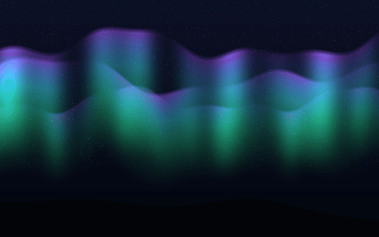
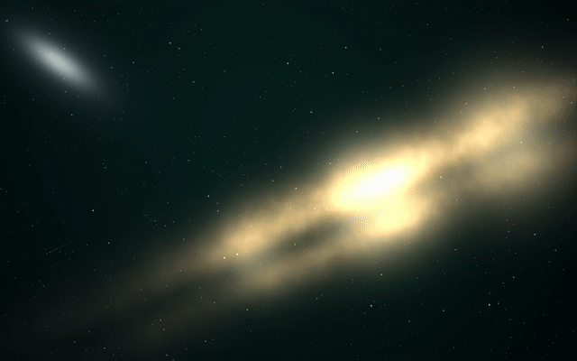
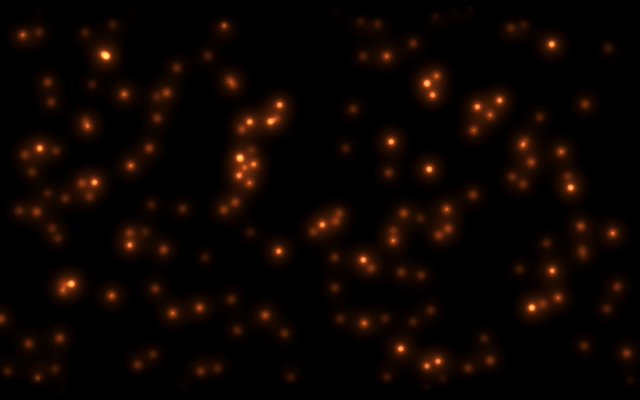
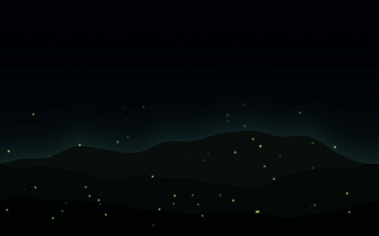

# duskpaper

Generative animated wallpapers for Wayland/Hyprland.

No video downloads. duskpaper renders seamless loops on your machine, at your
monitor's exact resolution, from procedural scene engines (numpy piped into
ffmpeg). Change the seed and you get a wallpaper nobody else has.

Five scenes, all built for working on top of: dark, slow, and quiet.

| scene | what you get | preview |
|---|---|---|
| `aurora` | northern lights breathing over a dark ridge |  |
| `galaxy` | slow drift across a Milky Way band, twinkling starfield, the odd meteor |  |
| `silk` | deep-blue curl-noise ribbons folding through each other |  |
| `embers` | warm sparks rising on true black |  |
| `fireflies` | a firefly meadow under a night sky |  |

Every loop is seamless by construction, not by luck. All motion in the engines
is an integer-frequency function of the loop phase, so the last frame flows
back into the first exactly. A 2-minute loop plays forever without a visible
seam.

## Install

You need `ffmpeg` and [`mpvpaper`](https://github.com/GhostNaN/mpvpaper)
(AUR: `mpvpaper`).

```sh
uv tool install git+https://github.com/marko-builds/duskpaper
# or: pipx install git+https://github.com/marko-builds/duskpaper
```

## Use

```sh
duskpaper list                 # scenes + palettes
duskpaper set aurora           # render at your resolution (cached), go live
duskpaper set silk --seed 3    # your own variant of the scene
duskpaper off                  # back to your static wallpaper
```

`set` detects your focused monitor via `hyprctl` (on other wlroots
compositors pass `--res WxH` explicitly), renders the loop once, caches it,
and runs it as your wallpaper via mpvpaper.

The one-time render is CPU-bound and depends on the scene, not your monitor:
fireflies about a minute, galaxy a few, embers and aurora around ten, silk
about twenty on a modern CPU. After that it's cached and instant.

`render` gives you the file without touching your desktop:

```sh
duskpaper render galaxy --res 3840x2160 --seconds 120 --out galaxy.mp4
```

Useful knobs on both: `--seed` (a different instance of the scene),
`--palette` (aurora, ember, ice, gold, nord; `duskpaper list` shows what each
scene supports), `--seconds`, `--fps`, `--native` (internal render width;
higher = finer detail, slower render).

## Cost while you work

* Decode is `hwdec=auto`. On an Intel iGPU a 1600p/30fps loop sits around 5%
  of one core.
* mpvpaper runs with auto-pause: when a fullscreen window covers the
  wallpaper, playback pauses and the cost drops to about zero.

## Omarchy / theme integration

On [Omarchy](https://omarchy.org), theme switches relaunch swaybg, which
covers the animated wallpaper. Two lines fix that.

Restore after theme changes, in `~/.config/omarchy/hooks/theme-set.d/50-duskpaper`:

```sh
#!/bin/bash
duskpaper on
```

Start on login, in `~/.config/hypr/autostart.conf`:

```
exec-once = duskpaper on
```

`duskpaper on` is a no-op unless a wallpaper is enabled, so both lines are
safe to keep permanently. `duskpaper off` restores your static wallpaper
exactly as it ran before.

One gotcha: Omarchy's wallpaper-cycle keybind (`omarchy theme bg next`) has
no hook, so it replaces the animated wallpaper with the theme's static one.
`duskpaper on` brings it back.

## License

MIT
