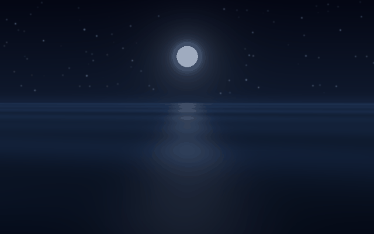

# duskpaper

Generative animated wallpapers for Wayland/Hyprland.

No video downloads. duskpaper renders seamless loops on your machine, at your
monitor's exact resolution, from procedural scene engines (numpy piped into
ffmpeg). Change the seed and you get a wallpaper nobody else has.

Six scenes, all built for working on top of: dark, slow, and quiet.

| scene | what you get | preview |
|---|---|---|
| `aurora` | northern lights breathing over a dark ridge |  |
| `galaxy` | slow drift across a Milky Way band, twinkling starfield, the odd meteor |  |
| `silk` | deep-blue curl-noise ribbons folding through each other |  |
| `embers` | warm sparks rising on true black |  |
| `fireflies` | a firefly meadow under a night sky |  |
| `tide` | a low moon laying a glade of light on slow, dark swell |  |

Every loop is seamless by construction, not by luck. All motion in the engines
is an integer-frequency function of the loop phase, so the last frame flows
back into the first exactly. A 2-minute loop plays forever without a visible
seam.

## Install

Runtime dependencies: `ffmpeg` (rendering) and
[`mpvpaper`](https://github.com/GhostNaN/mpvpaper) (playback, AUR: `mpvpaper`).
Python 3.11+, numpy and Pillow come in with the install. Nothing else, and
nothing is downloaded at runtime.

```sh
uv tool install git+https://github.com/marko-builds/duskpaper
# or: pipx install git+https://github.com/marko-builds/duskpaper
```

## Use

```sh
duskpaper list                 # scenes + palettes
duskpaper set aurora           # render at your resolution (cached), go live
duskpaper set silk --seed 3    # your own variant of the scene
duskpaper off                  # back to your static wallpaper
```

`set` detects your focused monitor via `hyprctl` (on other wlroots
compositors pass `--res WxH` explicitly), renders the loop once, caches it,
and runs it as your wallpaper via mpvpaper.

The one-time render is CPU-bound and depends on the scene, not your monitor:
fireflies about a minute, galaxy a few, tide around eight, embers and aurora
around ten, silk about twenty on a modern CPU. After that it's cached and instant.

`render` gives you the file without touching your desktop:

```sh
duskpaper render galaxy --res 3840x2160 --seconds 120 --out galaxy.mp4
```

Useful knobs on both: `--seed` (a different instance of the scene),
`--palette` (aurora, ember, ice, gold, nord; `duskpaper list` shows what each
scene supports), `--seconds`, `--fps`, `--native` (internal render width;
higher = finer detail, slower render).

## Cost while you work

* Decode is `hwdec=auto`. On an Intel iGPU a 1600p/30fps loop sits around 5%
  of one core.
* mpvpaper runs with auto-pause: when a fullscreen window covers the
  wallpaper, playback pauses and the cost drops to about zero.

## Omarchy / theme integration

On [Omarchy](https://omarchy.org), the desktop repaints its background on every
theme change, which covers the animated wallpaper. Two lines fix that.

Restore after a theme change, in
`~/.config/omarchy/hooks/theme-set.d/50-duskpaper` (make it executable):

```sh
#!/bin/bash
duskpaper on
```

Start on login. On Omarchy 4 ("Quattro"), in `~/.config/hypr/autostart.lua`:

```lua
o.exec_on_start("duskpaper on")
```

On Omarchy 3 and earlier, in `~/.config/hypr/autostart.conf`:

```
exec-once = duskpaper on
```

`duskpaper on` is a no-op unless a wallpaper is enabled, so both lines are safe
to keep permanently. `duskpaper off` puts your static wallpaper back.

Three things worth knowing about Omarchy 4 specifically:

* The background is painted inside `omarchy-shell` now, not by a separate
  swaybg process. duskpaper detects that and leaves the shell alone, so `off`
  uncovers the background that was underneath all along.
* Theme hooks get the theme slug as `$1`, so one hook can pick a scene per
  theme instead of restoring whatever ran last:

  ```sh
  #!/bin/bash
  case "$1" in
    nord)   duskpaper set silk --palette nord ;;
    *)      duskpaper on ;;
  esac
  ```

* The current-theme marker moved from `~/.config/omarchy/current/` to
  `~/.local/state/omarchy/current/`. Reading `$1` instead of either path keeps
  a hook correct on both versions.

On Omarchy 3, the wallpaper-cycle keybind (`omarchy theme bg next`) has no hook
and replaces the animated wallpaper with the theme's static one. `duskpaper on`
brings it back.

## Removing it

```sh
duskpaper off                                          # restore your wallpaper
uv tool uninstall duskpaper                            # or: pipx uninstall duskpaper
rm -rf ~/.local/share/duskpaper                        # cached renders
rm -rf ~/.config/duskpaper                             # state
rm -f ~/.config/omarchy/hooks/theme-set.d/50-duskpaper # the theme hook, if you added it
```

Then drop the `duskpaper on` line from your autostart file.

## License

MIT
